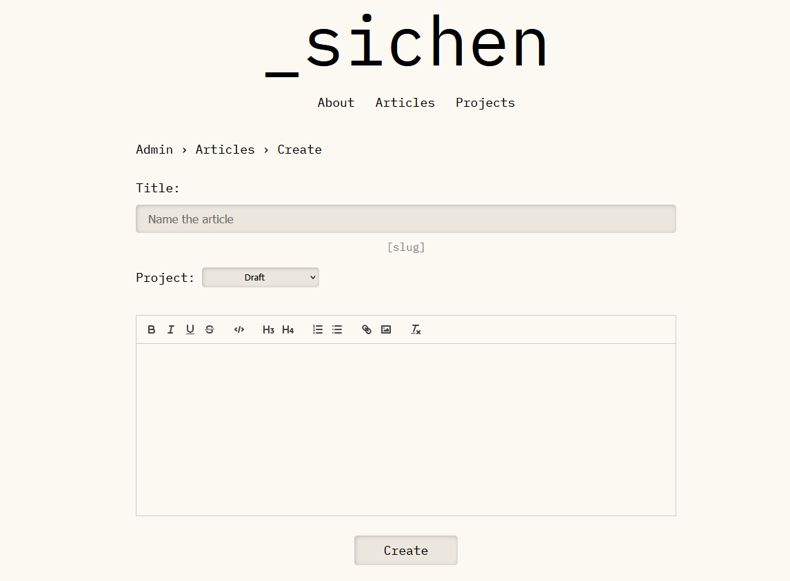
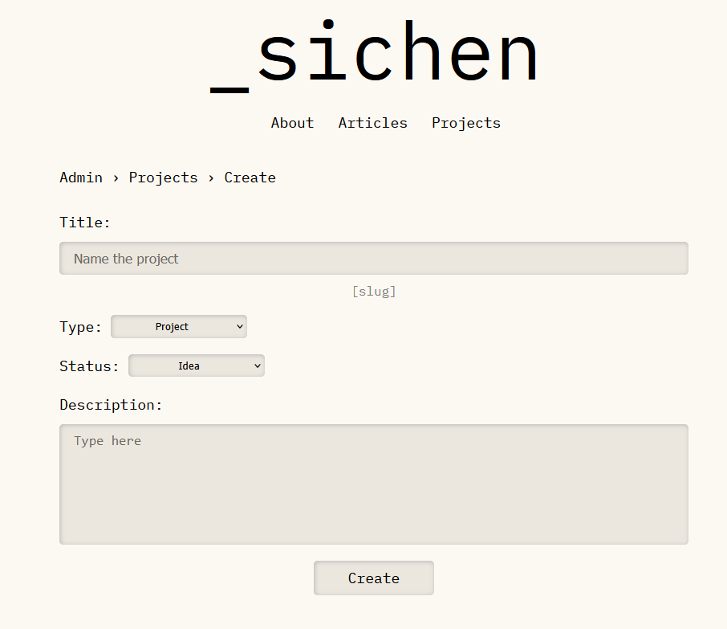
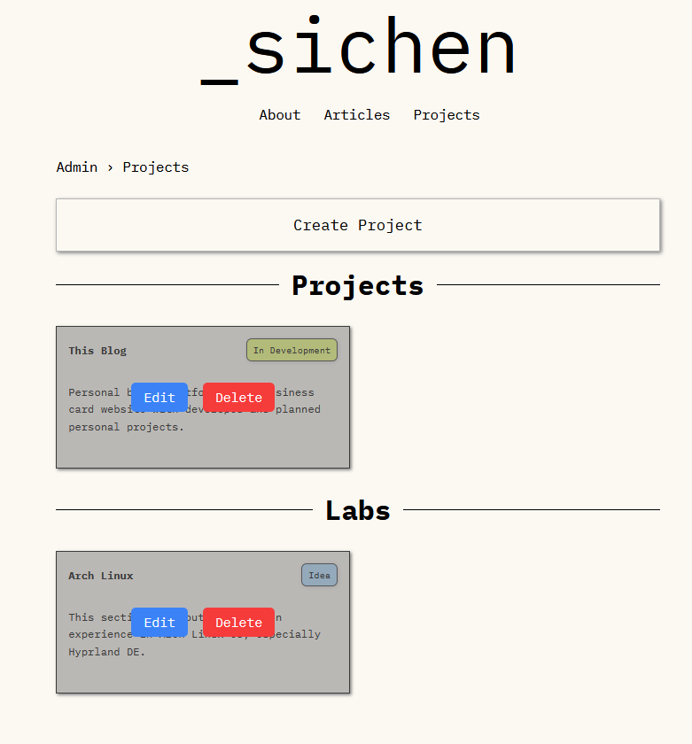

# Personal Blog Project

A full-stack blog platform with public pages for reading articles and an admin panel for managing content.

## Link
[sichen.dev](https://sichen.dev) — deployed from the original implementation

## Status
Work in progress. Rebuilding step by step, this repo will contain 
the full commit history from setup to deployment.

## Features
- Public pages for browsing and reading articles
- Admin panel: create, edit, and delete articles and projects
- Deployed on a VPS

## Tech Stack
**Frontend**: HTML, CSS, JavaScript, EJS

**Backend**: Node.js, Express, PostgreSQL

## Admin Pages Screenshots
### Create Article

### Create Project

### Project Editing/Deleting

